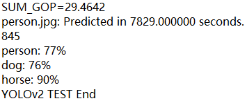
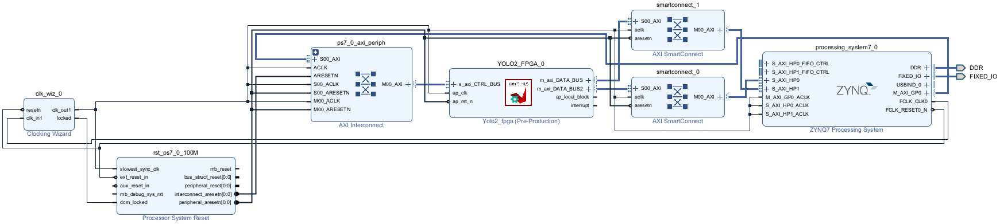
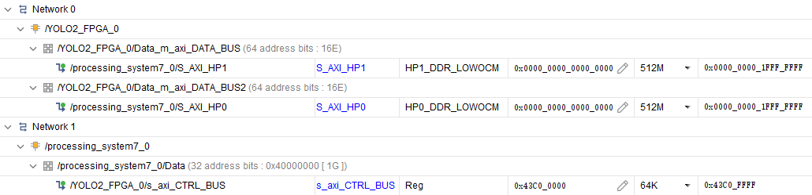
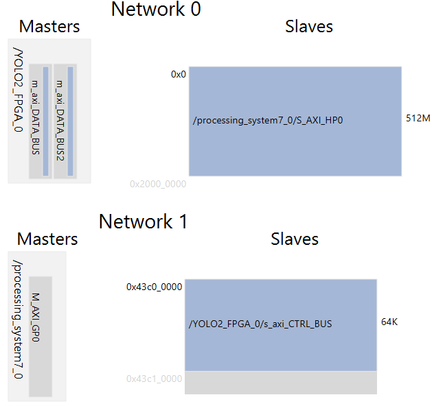
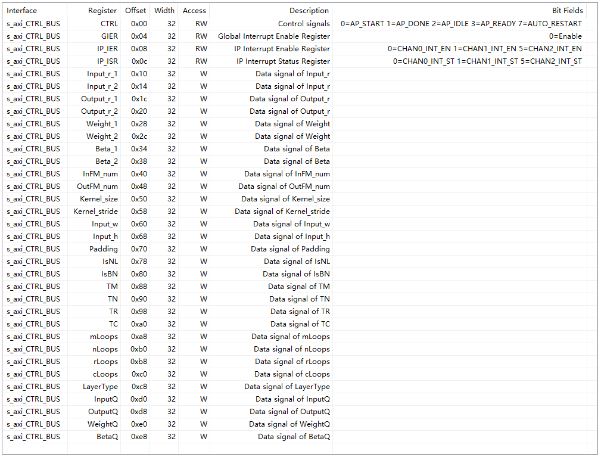

Source from [dhm2013724/yolov2_xilinx_fpga(100MHzTn2Tm32Tr26Tc26)](https://github.com/dhm2013724/yolov2_xilinx_fpga/tree/100MHzTn2Tm32Tr26Tc26)

Device: PYNQ-Z1(xc7z020clg400-1)

Vivado 2021.2 for block design, Vitis HLS 2021.2 for ip core synthesizing

# Problems in Implementaion

## Long C-sim Times



## M-AXI Number of Synthesized IP Core



## Address Allocation in Block Design





## API to Allocate Buffers

pynq.allocate will be used to allocate the buffer.

```python
# from pynq import Xlnk
from pynq import allocate
```
```python
#==================================================
#            allocated the memory  inbuff
#=================================================

# weight_base_buffer = xlnk.cma_array(shape=(25470896,), dtype=np.uint32)
weight_base_buffer = allocate(shape=(25470896,), dtype=np.uint32)
print("100M",weight_base_buffer.physical_address)
WEIGHT_BASE = weight_base_buffer.physical_address

# bate_base_buffer = xlnk.cma_array(shape=(5381,), dtype=np.uint32)
bate_base_buffer = allocate(shape=(5381,), dtype=np.uint32)
print("32k",bate_base_buffer.physical_address)
BETA_BASE=bate_base_buffer.physical_address

# img_base_buffer = xlnk.cma_array(shape=(4194304,), dtype=np.int32)
img_base_buffer = allocate(shape=(4194304,), dtype=np.int32)
print("16M",img_base_buffer.physical_address)
IMG_MEM = img_base_buffer.physical_address
```
```python
##============================================
#			clean  up
#============================================
# xlnk.xlnk_reset()
del weight_base_buffer, bate_base_buffer, img_base_buffer
```

## Address Offset Mismatch between the Synthesized IP Core and the ipynq File


```python
#XYOLO2_FPGA_CTRL_BUS_ADDR 
# XYOLO2_FPGA_CTRL_BUS_ADDR_AP_CTRL            =0x00
# XYOLO2_FPGA_CTRL_BUS_ADDR_GIE                =0x04
# XYOLO2_FPGA_CTRL_BUS_ADDR_IER                =0x08
# XYOLO2_FPGA_CTRL_BUS_ADDR_ISR                =0x0c
# XYOLO2_FPGA_CTRL_BUS_ADDR_INPUT_R_DATA       =0x10
# XYOLO2_FPGA_CTRL_BUS_ADDR_OUTPUT_R_DATA      =0x18
# XYOLO2_FPGA_CTRL_BUS_ADDR_WEIGHT_DATA        =0x20
# XYOLO2_FPGA_CTRL_BUS_ADDR_BETA_DATA          =0x28
# XYOLO2_FPGA_CTRL_BUS_ADDR_INFM_NUM_DATA      =0x30
# XYOLO2_FPGA_CTRL_BUS_ADDR_OUTFM_NUM_DATA     =0x38
# XYOLO2_FPGA_CTRL_BUS_ADDR_KERNEL_SIZE_DATA   =0x40
# XYOLO2_FPGA_CTRL_BUS_ADDR_KERNEL_STRIDE_DATA =0x48
# XYOLO2_FPGA_CTRL_BUS_ADDR_INPUT_W_DATA       =0x50
# XYOLO2_FPGA_CTRL_BUS_ADDR_INPUT_H_DATA       =0x58
# XYOLO2_FPGA_CTRL_BUS_ADDR_PADDING_DATA       =0x60
# XYOLO2_FPGA_CTRL_BUS_ADDR_ISNL_DATA          =0x68
# XYOLO2_FPGA_CTRL_BUS_ADDR_ISBN_DATA          =0x70
# XYOLO2_FPGA_CTRL_BUS_ADDR_TM_DATA            =0x78
# XYOLO2_FPGA_CTRL_BUS_ADDR_TN_DATA            =0x80
# XYOLO2_FPGA_CTRL_BUS_ADDR_TR_DATA            =0x88
# XYOLO2_FPGA_CTRL_BUS_ADDR_TC_DATA            =0x90
# XYOLO2_FPGA_CTRL_BUS_ADDR_MLOOPS_DATA        =0x98
# XYOLO2_FPGA_CTRL_BUS_ADDR_NLOOPS_DATA        =0xa0
# XYOLO2_FPGA_CTRL_BUS_ADDR_RLOOPS_DATA        =0xa8
# XYOLO2_FPGA_CTRL_BUS_ADDR_CLOOPS_DATA        =0xb0
# XYOLO2_FPGA_CTRL_BUS_ADDR_LAYERTYPE_DATA     =0xb8
# XYOLO2_FPGA_CTRL_BUS_ADDR_INPUTQ_DATA        =0xc0
# XYOLO2_FPGA_CTRL_BUS_ADDR_OUTPUTQ_DATA       =0xc8
# XYOLO2_FPGA_CTRL_BUS_ADDR_WEIGHTQ_DATA       =0xd0
# XYOLO2_FPGA_CTRL_BUS_ADDR_BETAQ_DATA         =0xd8

XYOLO2_FPGA_CTRL_BUS_ADDR_AP_CTRL            =0x00
XYOLO2_FPGA_CTRL_BUS_ADDR_GIE                =0x04
XYOLO2_FPGA_CTRL_BUS_ADDR_IER                =0x08
XYOLO2_FPGA_CTRL_BUS_ADDR_ISR                =0x0c
XYOLO2_FPGA_CTRL_BUS_ADDR_INPUT_R_DATA       =0x10
XYOLO2_FPGA_CTRL_BUS_ADDR_OUTPUT_R_DATA      =0x1c
XYOLO2_FPGA_CTRL_BUS_ADDR_WEIGHT_DATA        =0x28
XYOLO2_FPGA_CTRL_BUS_ADDR_BETA_DATA          =0x34
XYOLO2_FPGA_CTRL_BUS_ADDR_INFM_NUM_DATA      =0x40
XYOLO2_FPGA_CTRL_BUS_ADDR_OUTFM_NUM_DATA     =0x48
XYOLO2_FPGA_CTRL_BUS_ADDR_KERNEL_SIZE_DATA   =0x50
XYOLO2_FPGA_CTRL_BUS_ADDR_KERNEL_STRIDE_DATA =0x58
XYOLO2_FPGA_CTRL_BUS_ADDR_INPUT_W_DATA       =0x60
XYOLO2_FPGA_CTRL_BUS_ADDR_INPUT_H_DATA       =0x68
XYOLO2_FPGA_CTRL_BUS_ADDR_PADDING_DATA       =0x70
XYOLO2_FPGA_CTRL_BUS_ADDR_ISNL_DATA          =0x78
XYOLO2_FPGA_CTRL_BUS_ADDR_ISBN_DATA          =0x80
XYOLO2_FPGA_CTRL_BUS_ADDR_TM_DATA            =0x88
XYOLO2_FPGA_CTRL_BUS_ADDR_TN_DATA            =0x90
XYOLO2_FPGA_CTRL_BUS_ADDR_TR_DATA            =0x98
XYOLO2_FPGA_CTRL_BUS_ADDR_TC_DATA            =0xa0
XYOLO2_FPGA_CTRL_BUS_ADDR_MLOOPS_DATA        =0xa8
XYOLO2_FPGA_CTRL_BUS_ADDR_NLOOPS_DATA        =0xb0
XYOLO2_FPGA_CTRL_BUS_ADDR_RLOOPS_DATA        =0xb8
XYOLO2_FPGA_CTRL_BUS_ADDR_CLOOPS_DATA        =0xc0
XYOLO2_FPGA_CTRL_BUS_ADDR_LAYERTYPE_DATA     =0xc8
XYOLO2_FPGA_CTRL_BUS_ADDR_INPUTQ_DATA        =0xd0
XYOLO2_FPGA_CTRL_BUS_ADDR_OUTPUTQ_DATA       =0xd8
XYOLO2_FPGA_CTRL_BUS_ADDR_WEIGHTQ_DATA       =0xe0
XYOLO2_FPGA_CTRL_BUS_ADDR_BETAQ_DATA         =0xe8
```